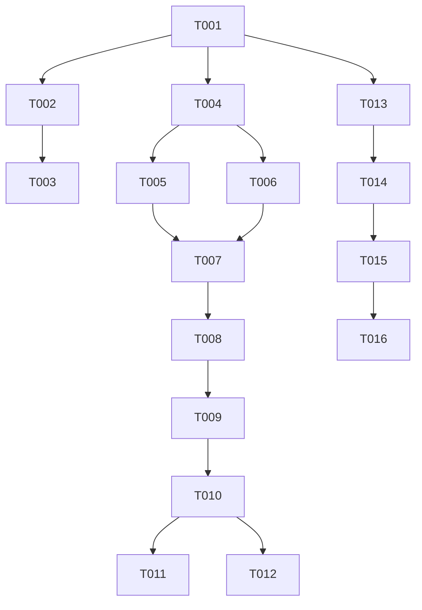

# Implementation Tasks: News, Pests Pages, and Calendar Bug Fix

**Feature**: 005-news-pests
**Spec**: [spec.md](spec.md) | **Plan**: [plan.md](plan.md)

## Implementation Strategy

We will follow an incremental approach:
1. **MVP**: Fix the Calendar Bug (US4) as it's a critical production issue.
2. Implement the Pests Database (US2) and connect it to Crops (US3).
3. Implement the News Overview with dummy data (US1).

## Phase 1: Setup & Foundational
Goal: Ensure the foundation is ready for the new UI components and models.

- [x] T001 Verify project environment and install any new icons if needed.

## Phase 2: User Story 4 - Calendar Task Click Bug Fix
**Goal**: Prevent the application from crashing when a calendar date containing a task is clicked.
**Independent Test**: Add a task to a calendar date, click the date, and ensure the `DayViewOpen` modal opens without the page turning white.

- [x] T002 [US4] Review `frontend/src/components/Task/TaskList.jsx` and `frontend/src/components/Task/TaskItem.jsx` for missing properties or unsafe operations.
- [x] T003 [US4] Fix the crash bug in `frontend/src/pages/calendar/CalendarPage.jsx` and related task components.

## Phase 3: User Story 2 - Browsing Pests and Classifications
**Goal**: View a list of pests, their classifications, and targeted plants.
**Independent Test**: Navigate to the Pests page and view pest details.

- [x] T004 [US2] Create Pest model in `backend/src/models/Pest.js`.
- [x] T005 [P] [US2] Implement pest controllers for CRUD in `backend/src/controllers/pestController.js`.
- [x] T006 [P] [US2] Implement pest routes in `backend/src/routes/pestRoutes.js` and register in backend.
- [x] T007 [US2] Create `frontend/src/components/Pests/PestList.jsx` and `frontend/src/components/Pests/PestItem.jsx`.
- [x] T008 [US2] Create `frontend/src/pages/pests/PestsPage.jsx`.
- [x] T009 [US2] Add the Pests page to the main navigation/routing in `frontend/src/App.jsx`.

## Phase 4: User Story 3 - Pest and Crop Connection
**Goal**: Navigate between crops and pests seamlessly.
**Independent Test**: View a crop to see its related pests, and view a pest to see its targeted crops.

- [x] T010 [US3] Update `backend/src/models/Crop.js` to reference pests (if required by design).
- [x] T011 [P] [US3] Update `frontend/src/pages/crops/CropDetails.jsx` to display related pests.
- [x] T012 [P] [US3] Update `frontend/src/components/Pests/PestItem.jsx` to display links to targeted crops.

## Phase 5: User Story 1 - Viewing News Overview
**Goal**: Provide users with an overview and highlights of agricultural news articles using static dummy data.
**Independent Test**: Navigate to the News page and verify dummy news articles are displayed.

- [x] T013 [US1] Create a dummy data file for news in `frontend/src/data/dummyNews.json`.
- [x] T014 [US1] Create `frontend/src/components/News/NewsList.jsx` and `frontend/src/components/News/NewsItem.jsx`.
- [x] T015 [US1] Create `frontend/src/pages/news/NewsPage.jsx`.
- [x] T016 [US1] Add the News page to the main navigation/routing in `frontend/src/App.jsx`.

## Phase 6: Polish & Cross-Cutting Concerns
**Goal**: Ensure code quality, UI responsiveness, and overall polish.

- [x] T017 Review and ensure all new pages (News, Pests) are fully responsive and meet WCAG 2.1 AA accessibility guidelines.
- [x] T018 Write or update unit tests for the Calendar bug fix.

## Dependencies

